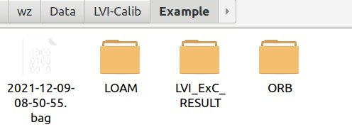

#### Thirdparty Dependence

- [ROS](http://wiki.ros.org/ROS/Installation)
- [OpenCV](https://opencv.org/releases/)
- [Eigen3](https://eigen.tuxfamily.org/index.php?title=Main_Page)
- [Ceres Solver](http://ceres-solver.org/)
- [PCL](https://pointclouds.org/)

#### Build

- clone this repository to your directory of ROS workspace
-  ```catkin_make```

#### How to run
- Set configurations in "src/lvi_calib/cfg/lvi.yaml"

  - The folder structure is as follows:

    

- Save camera trajectory from ORB-SLAM2 to the "ORB" folder

  - Download the vocabulary from the original repository of ORB-SLAM2

    ```roslaun
    roslaunch lvi_exc write_orb_slam_results.launch
    ```

- Save LiDAR trajectory from LOAM to the "LOAM" folder

  - The modified A-LOAM is included in this repository

    ``````
    roslaunch aloam_velodyne aloam_velodyne_VLP_16.launch bag_filename:=YOUR_RECORDED_BAGFILE
    ``````

- Calibrate LiDAR-Camera-IMU extrinsics

  ```roslaunch lvi_exc lvi_init_orb_surfel.launch ```

#### Acknowledgements

- The authors of [LI-Calib]()
- The authors of [Kontiki]()
- The authors of [ORB-SLAM2]()
- The authors of [A-LOAM]()
- The authors of [ndt-omp]()